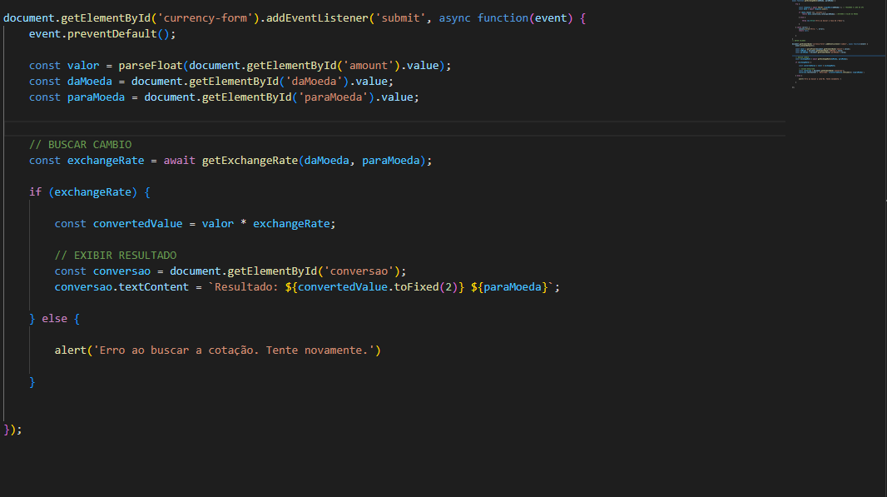

> # **Conversor de Moedas**

----------------------------------------------------------------------------------------------

## **Descrição Geral**

Este projeto é uma evolução de um projeto anterior, desenvolvido na AVPI, que visa a criação de uma aplicação web para conversão de moedas. A aplicação permite que o usuário insira um valor em uma moeda de origem e escolha uma moeda de destino, realizando a conversão com base nas taxas de câmbio atualizadas em tempo real, utilizando HTML5, CSS3 e JavaScript (puro).

A principal diferença em relação ao projeto anterior é a integração com uma API de câmbio, que permite consultar as taxas de conversão em tempo real, garantindo valores sempre atualizados de acordo com as variações do mercado.

## **Funcionalidades**

- **Entrada de Valor**: O usuário pode inserir o valor em uma moeda de origem para ser convertido.
- **Seleção de Moedas**: O usuário escolhe a moeda de origem e a moeda de destino a partir de uma lista (por exemplo, Dólar, Euro, Real, etc.).
- **Conversão em Tempo Real**: A aplicação consulta uma API de câmbio (ExchangeRate-API, por exemplo) para obter a taxa de conversão atualizada e realizar a conversão.
- **Reset**: O formulário inclui um botão de "Limpar" para redefinir os campos e permitir uma nova conversão.
- **Exibição de Resultados**: O valor convertido é exibido diretamente na interface de forma clara.

## **Requisitos Técnicos**

- **HTML5**: A estruturação da página foi feita utilizando tags semânticas como form, input, select, entre outras.
- **CSS3**: O estilo da página é responsivo, utilizando boas práticas de layout e design.
- **JavaScript Puro**: Implementação da lógica para interação com a API e realização da conversão, utilizando fetch para requisições HTTP.

## **Integração com API**

A aplicação utiliza a API *ExchangeRate-API* para obter taxas de câmbio em tempo real. A API é consultada sempre que o usuário solicita uma conversão, e a taxa obtida é utilizada para calcular o valor convertido.

Para usar a API, é necessário obter uma chave de API, que é inserida no código para autenticação.

## **Como Usar**

1. **Insira o valor**: No campo "Valor", insira o valor que deseja converter.
2. **Escolha as moedas**: Selecione a moeda de origem ("De") e a moeda de destino ("Para").
3. **Clique em "Converter"**: A conversão será feita automaticamente utilizando a taxa de câmbio mais recente.
4. **Clique em "Limpar"**: Para reiniciar o formulário e tentar uma nova conversão.

## **Estrutura do Código**

### **HTML**

**Explicação**:
- A estrutura do HTML contém um formulário para inserção do valor e escolha das moedas.
- O formulário tem dois campos de seleção (select) para as moedas de origem e destino, além de um campo de entrada para o valor.
- Os botões permitem que o usuário faça a conversão ou limpe os campos.

### **JavaScript**

**Explicação**:
- A função getExchangeRate faz uma requisição à API para obter a taxa de câmbio entre as moedas selecionadas.
- O evento submit do formulário captura o valor e as moedas escolhidas, chama a função de conversão e exibe o resultado.

### **CSS**

**Explicação**:
- O CSS aplica um layout simples e responsivo, com uma paleta de cores suave para proporcionar uma boa experiência ao usuário.
- As entradas de dados e os botões possuem bordas arredondadas e transições suaves para melhorar a usabilidade.

## **Como Executar**

1. Clone este repositório ou baixe os arquivos.
2. Abra o arquivo index.html em um navegador de sua escolha.
3. Certifique-se de que o arquivo JavaScript e o CSS estão corretamente vinculados.

## **Tratamento de Erros**

- Se houver um problema ao acessar a API ou realizar a conversão, será exibida uma mensagem de erro clara.
- Se o valor inserido não for válido ou algum campo necessário estiver vazio, o formulário não será submetido.

----------------------------------------------------------------------------------------------------------------------
*Por Melissa de Souza Pinto*